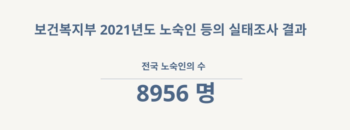

# U:ON PROJECT

작업 영역: IT 프로젝트
작업기간: 2024년 6월 1일 → 2024년 7월 2일

# [프로젝트 한줄 소개]

## 노숙인의 정신 건강 증진과 사회 재창출을 위한 취미 매칭 서비스

- 2024년 제12회 SW개발 공모전 피우다 프로젝트

# [프로젝트 배경]

### 1. 2021년 보건복지부 노숙인 등의 실태조사 결과

### 2. 노숙 원인 및 우울증, 알코올 중독 비율

### 3. 취미 생활이 노숙인들에게 미치는 영향

# [프로젝트 주요 기능]

### 1. 위치를 기반으로 자율적인 취미 활동 생성 및 참여 기회 제공

### 2. 쪽지를 통한 간편한 소통

### 3. 교육, 취업 등 노숙인 대상 프로그램 정보를 제공하는 게시판

# [프로젝트 주요 기술]

- 백엔드
  - SpringBoot
  - JWT
  - MySql
  - MyBatis
- 프론트엔드
  - React + typescript
  - node.js
    - 웹서버
  - ContextAPI

# [프로젝트 협업 관리]

- 형상관리
  - github
- 일정관리
  - notion
